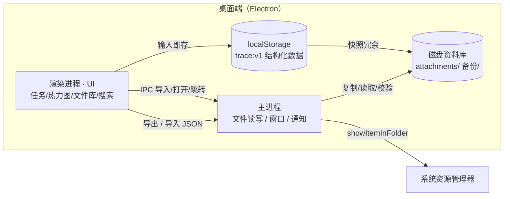
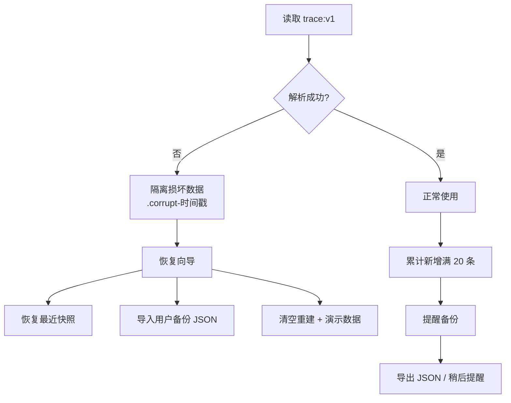

# Leave a Trace（留痕）项目设计方案书

| 项目名称 | Leave a Trace（留痕） |
|----------|----------------------|
| 文档版本 | v1.4 |
| 编写日期 | 2026-08-06 |
| 文档状态 | 待评审（第一次交流稿） |
| 文档类型 | 项目设计方案 / PRD |
| 修订记录 | v1.0 初稿（2026-08-06）；v1.1 新增"月度汇总与月报生成"模块（2026-08-06）；v1.2 决策确认：MD 与 PDF 两种格式都做，生成物自动归档进文件库（2026-08-06）；v1.3 决策确认：技术路线定为"纯网页原型先行 → Electron 套壳"（2026-08-06）；v1.4 新增三套可切换视觉风格：纸感手账 / 墨夜深色 / 现代克制（2026-08-06） |

---

## 1. 项目概述

### 1.1 一句话定位

留痕是一款纯本地的桌面端个人工作记录工具：每天记下已完成、未完成、正在进行的任务，用打卡动效和热力图把"做过的事"变成看得见的痕迹，同时收纳每天的表格和 PDF，需要时一键找回。

### 1.2 产品愿景

让每一份付出都被看见，让每一天都有迹可循。

### 1.3 背景与痛点

- 日常工作碎片化，任务散落在脑子和聊天记录里，缺少一个"每天翻开、随手记录"的落脚点；
- 只记不做没有反馈，完成与否缺乏仪式感和紧迫感，任务容易无声无息地逾期；
- 事后想回顾"我最近忙了什么"，没有直观的时间维度视图（日 / 周 / 月）；
- 日报表格、PDF 等文件散落各处，与当天的工作内容脱节，找文件靠翻文件夹；
- 现有工具要么需要联网、要么数据被平台锁定，用户希望数据完全属于自己、关掉页面也不丢。

### 1.4 项目目标

- 用户在 10 秒内完成"添加一条任务"、3 秒内完成"打卡/勾选"，数据输入即保存；
- 未按时完成的任务必须被明显提示并引导跟进，杜绝"悄悄逾期"；
- 通过日 / 周 / 月热力图，用户能在 10 秒内看清任意时间段的工作密度；
- 文件与任务同库管理，任意一天的文件可在 2 步内打开或跳转到系统文件夹；
- 全流程纯本地运行，无任何云依赖；数据可随时导出备份、损坏可恢复；
- 视觉克制、高级、有生活感，避免千篇一律的模板化卡片风。

---

## 2. 目标用户与核心场景

### 2.1 用户画像

| 用户层级 | 画像 | 核心诉求 |
|----------|------|----------|
| 核心用户 | 需要每日规划与复盘的职场人、自由职业者、学生 | 记录当天工作、形成持续打卡习惯 |
| 次核心用户 | 管理多个项目、文件密集的岗位（运营、产品、行政、科研） | 任务与报表/PDF 文件关联管理、快速查找 |
| 拓展用户 | 注重隐私、不信任云服务的个人知识管理爱好者 | 纯本地、数据可迁移、可长期积累 |

### 2.2 核心场景

| 场景 | 描述 | 典型诉求 |
|------|------|----------|
| 每日记录 | 早上列计划，工作中随时勾选完成 | 添加快、状态清楚、即存不丢 |
| 完成打卡 | 今天任务全部收尾，点"打卡" | 有仪式感的完成动效，形成正反馈 |
| 时限管理 | 给任务设定截止时间 | 临近时渐变色提醒，逾期立即提示并跟进 |
| 阶段回顾 | 看这周 / 这月到底做了什么 | 热力图一眼看出忙碌与空档 |
| 文件归档 | 把当天日报表格、PDF 收进应用 | 按日期/类型浏览、预览、跳转文件夹 |
| 查找文件 | 只记得关键词，忘了放在哪 | 搜索任务或文件名，直接跳转定位 |
| 换机迁移 | 备份数据、新电脑恢复 | JSON 导出导入，无条数限制 |

---

## 3. 功能设计

### 3.1 功能总览

| 模块 | 功能 | 优先级 |
|------|------|--------|
| 每日工作记录 | 任务三态（已完成/进行中/未完成）、即存、补写 | P0 |
| 打卡与动态反馈 | 完成动画、时限渐变、逾期跟进、每日打卡 | P0 |
| 热力图统计 | 日 / 周 / 月三视图（对标 90 天计划） | P0 |
| 月度汇总 | 当月完成情况整合、按日列举事项、生成 PDF/MD、二级页面归档查看 | P0 |
| 文件库 | xlsx/PDF 入库、目录浏览、预览、跳转文件夹 | P0 |
| 全局搜索 | 任务 + 文件名关键词搜索、跳转定位 | P0 |
| 数据安全 | 即存 localStorage、JSON 导入导出、满 20 条提醒、损坏恢复 | P0 |
| 演示数据 | 首次启动预置少量可清空示例 | P0 |
| 深色主题 | 暖色浅色为主，深色模式 | P1 |
| 文件全文检索 | PDF / 表格内容分词索引 | P1 |
| 桌面通知 | 逾期、打卡提醒（可选开关） | P1 |

### 3.2 每日工作记录

**核心规则：一切输入即保存，无保存按钮。** 用户在输入框敲完字、勾选任务、改状态的瞬间写入 localStorage，刷新、关闭、重启后数据仍在。

#### 3.2.1 任务状态模型

任务只有三种状态，对应需求中的"已完成、未完成、正在进行"：

| 状态 | 含义 | 视觉 | 触发 |
|------|------|------|------|
| `in_progress` 进行中 | 正在做 / 待办中 | 左侧状态点呼吸动画 | 新建默认；点击"开始" |
| `done` 已完成 | 今天做完 | 打勾 + 完成动画 + 置灰 | 点击完成 |
| `pending` 未完成 | 没做完（含逾期未做） | 状态点变暗，逾期时红色警示 | 手动标记放弃 / 逾期自动进入跟进区 |

#### 3.2.2 任务字段

| 字段 | 说明 |
|------|------|
| `id` | 唯一标识 |
| `text` | 任务内容（必填） |
| `status` | 三态之一 |
| `createdAt` | 创建时间 |
| `deadline` | 截止时间（可选；无时限任务不做渐变） |
| `completedAt` | 完成时间 |
| `tags` | 标签，参与搜索 |
| `note` | 备注，参与搜索 |
| `order` | 排序权重 |

#### 3.2.3 交互规则

- 默认打开"今天"页；可切换任意日期查看历史，支持补写过去日期（只改日期键，不改时间戳）；
- 添加任务：顶部输入框回车即建即存；支持快捷语法 `任务名 18:00` 直接带截止时间（沿用 90 天计划 `任务名 30` 的时间盒习惯）；
- 编辑/删除/拖拽排序全部即时生效；
- 页面顶部进度小结：`已完成 X / 共 Y · 进行中 M · 未完成 N`；
- 未完成任务的"放弃"动作需要二次确认，避免误操作。

### 3.3 打卡与动态反馈

这是本产品的"情绪层"：给每一个动作即时、克制的反馈。

#### 3.3.1 任务状态机与动效

| 状态 | 触发条件 | 视觉与动效 |
|------|----------|------------|
| 常态进行中 | 默认 | 任务行无强调；左侧圆点轻微呼吸（2s 循环） |
| 临近截止 | 剩余时间 ≤ 设定阈值（默认 1 小时，可在设置调整） | 任务行由主色向琥珀色**渐变**（CSS 变量 + transition，随剩余时间连续变化）；右侧出现倒计时文字 |
| 已逾期 | 超过截止时间且未完成 | 任务行红色渐变、左侧红点脉冲；顶部出现"逾期横幅"；可选桌面通知；任务自动进入"需跟进"区并置顶 |
| 完成 | 点击勾选 | 打勾 SVG 描边动画（约 500ms）+ 行背景淡彩扫过 + 轻微上浮；连续完成 3 项触发一次轻量庆祝动效 |
| 每日打卡 | 点击"打卡"按钮 | 印章/涟漪动画（约 800ms），当天在热力图中高亮 |

#### 3.3.2 渐变规则

- 渐变只对设置了 `deadline` 的任务生效；
- 渐变进度 = `剩余时间 ÷ 总时限`，颜色在 主色 → 琥珀 → 砖红 之间连续过渡（使用 `color-mix()` 或预置关键帧），避免跳变；
- 未设时限的任务保持常态，不误报。

#### 3.3.3 逾期跟进

- 逾期任务自动置顶到"需跟进"区，显示 `已逾期 X 小时 · 需快速跟进`；
- 提供三个一键动作：**顺延**（改截止时间，重置渐变）、**标记完成**、**标记放弃**（归档为未完成，当天计入"未完成"）；
- 跟进的任何操作即存。

#### 3.3.4 每日打卡

- 每天一个独立打卡条目（时间、方式），与任务完成度解耦：任务没做完也可以打卡（记录"今天来过"），完成度作为热力图数据源；
- 打卡后当天日期在所有视图中高亮；支持补打卡（勾选历史日期）。

### 3.4 热力图统计（对标 90 天计划）

直接参考 `E:\My-task_notes-master\My-task_notes-master\06-人生管理\90天计划` 的实现，共三层视图：

| 视图 | 对标参考 | 说明 |
|------|----------|------|
| 日视图 | `stats_daily.html` + `.heatmap` | 最近 90 天，7 行（周一~周日）列向流动，格子 16px、圆角 4px、5 级色阶，颜色 = 当天完成率 |
| 周视图 | `stats_weekly.html` | 每周进度条 + 完成率百分比，点击周条展开每日明细 |
| 月视图 | `stats_monthly.html` | 12 个月卡片，卡片带星期表头（一~日）+ 当月日期格子，点击格子查看当天任务明细；年份切换 |

**在参考实现基础上的升级点：**

- 热力色阶由蓝色系改为与产品一致的暖绿色系（`lv-0` 空 / `lv-1`~`lv-5` 五级，沿用 `heatLevel` 的 0/25/50/75/100 分级逻辑）；
- 指标可切换：完成率 ↔ 当日专注时长（P1）；
- 空记录日与"有记录但未完成"视觉上区分；
- 点击任意格子弹出当日任务明细，支持从明细一键跳回当天任务页；
- 数据完全来自 localStorage 实时聚合，不落临时文件。

### 3.5 月度汇总与月报生成

**定位：把当月每天的完成情况自动整合成一份"月度回顾"，按日列举事项与状态，一键生成 PDF / Markdown，归档到独立的"月度汇总"二级页面，随时回看、随时导出。**

#### 3.5.1 汇总规则

- 默认聚合自然月（当月 1 日 ~ 月末），支持切换任意历史月份；
- 数据来源：`days[date].tasks`（三态）与 `checkIn`，实时计算、不落中间态；
- 统计指标：总任务数、已完成 / 完成率、进行中、未完成（含逾期）、打卡天数、逾期任务数。

#### 3.5.2 月报内容结构（模板）

| 区块 | 内容 |
|------|------|
| 标题 | `2026 年 8 月工作汇总 · 留痕` |
| 概览 | 完成率、打卡天数、逾期数等指标 + 当月完成率迷你热力图 |
| 按日明细 | 每天：日期 + 任务清单（✓ 已完成 / ● 进行中 / ◌ 未完成，附截止时间、标签、备注） |
| 需跟进清单 | 当月逾期 / 未完成任务集中列表，标注逾期时长 |
| 生成信息 | 生成时间、数据版本 |

#### 3.5.3 生成与归档

- 一键生成 Markdown：本地模板渲染，即存，可再编辑；
- 一键导出 PDF：Electron `printToPDF` 排版输出（内嵌中文字体、热力图随文呈现）；
- 生成物自动归档：进入"月度汇总"二级页面（按月索引），同时登记进文件库索引，可被全局搜索命中；
- 重新生成默认覆盖当月旧版，P1 提供历史版本保留与对比。

**产品决策（2026-08-06）：MD 与 PDF 两种格式均支持（PDF 正式版、MD 可编辑版）；所有生成物自动归档进文件库索引，可被全局搜索命中。**

#### 3.5.4 二级页面查看

- 导航新增"月度汇总"页：月份选择器 + 当月总览指标 + 已生成月报列表；
- 页内直接预览：MD 渲染为可读文档，PDF 内置翻页预览；
- "在文件夹中显示"跳转到月报存储目录（`留痕资料库/月报/YYYY-MM/`）。

### 3.6 文件库

#### 3.6.1 文件范围与入库方式

| 类型 | 优先级 | 说明 |
|------|--------|------|
| xlsx / xls | P0 | 只读预览（SheetJS），编辑用系统默认软件打开 |
| pdf | P0 | 内置预览（PDF.js） |
| csv / docx / 图片 | P1 | 后续扩展 |

两种入库模式，**推荐默认"复制入库"**：

| 模式 | 行为 | 优点 | 缺点 |
|------|------|------|------|
| A 复制入库（默认） | 导入时把文件复制到应用资料库 `留痕资料库/attachments/年/月/`，登记索引 | 文件随应用走，移动/重装不丢；路径可控 | 占用双份磁盘 |
| B 仅索引 | 只登记原路径，不复制 | 不占额外空间 | 原文件移动/改名后失效，需重新定位 |

#### 3.6.2 目录浏览

- 两个维度：**按日期**（年 → 月 → 日）和 **按类型**（表格 / PDF）；
- 列表展示：文件名、所属日期、大小、标签、导入时间；
- 拖拽文件到窗口即导入（P0）。

#### 3.6.3 打开与跳转

- **预览**：PDF 内置翻页预览；表格只读预览（前 N 行 + 工作表切换）；
- **用系统软件打开**：调用系统默认程序（`shell.openPath`）；
- **在文件夹中显示**：调用系统资源管理器定位文件（`shell.showItemInFolder`），这是需求"跳转到文件夹中可以调用"的直接落点；
- **缺失检测**：启动时扫描索引，文件不存在时标记"文件已移动"，提供重新定位或移除。

### 3.7 全局搜索

| 检索范围 | 优先级 |
|----------|--------|
| 任务文本、标签、备注 | P0 |
| 文件名、日期（如"8月6日"、"2026-08-06"） | P0 |
| PDF / 表格内容全文 | P1（本地索引，逐文件离线建索引） |

#### 3.7.1 交互

- 顶部常驻全局搜索栏，输入即联想（200ms 防抖）；
- 结果分两组："当日记录"与"文件"，每条显示命中关键词上下文 + 日期；
- **文件结果**：点击 → 跳到文件库定位并高亮该文件；提供"在文件夹中显示"按钮直接跳转系统目录；
- **任务结果**：点击 → 跳到对应日期任务页并高亮该任务；
- 中文按 bigram 建立本地倒排索引，保证万条级数据不卡顿。

### 3.8 数据安全与备份

#### 3.8.1 即存与失败提示

- 所有输入（文本、勾选、排序、导入）通过统一存储层写入 localStorage，**单键 `trace:v1` 保存全量结构数据**；
- 写入失败（配额满、被清空等）→ 立即弹明确提示："保存失败，数据未落盘，请检查磁盘空间"，绝不静默吞错；
- 读取时做 schema 版本校验，版本不符给出升级/恢复引导。

#### 3.8.2 JSON 导出与导入

- **导出**：一键导出全部数据（含版本、日期范围、记录数），文件名 `留痕备份-YYYYMMDD-HHmmss.json`；
- **导入**：选择 JSON → 校验 → 预览（记录数、日期范围、文件索引数）→ 选择 **合并**（按日期键覆盖）或 **替换**；
- **不限条数**：导入不做条数上限；容量只受 localStorage 配额约束，配额不足时引导清理或导出后重置；
- 导入前自动生成当前数据快照，可一键回滚。

#### 3.8.3 满 20 条提醒

- 每当新增记录累计满 20 条（任务新增 + 文件新增计数），弹出非阻塞提醒："建议备份"；
- 三个选项：立即导出 / 稍后提醒 / 本月不再提醒。

#### 3.8.4 数据损坏与恢复

| 场景 | 处理 |
|------|------|
| 读取解析失败 | 损坏数据自动另存为 `.corrupt-时间戳` 备份后隔离，弹恢复向导 |
| 有自动快照 | 向导提供"恢复最近快照"（正常退出/每日首次打开时自动写一份快照） |
| 有用户备份 | 向导提供"导入备份文件" |
| 全部不可用 | 向导提供"清空重建"，重建后预置演示数据 |

#### 3.8.5 演示数据

- 首次启动预置少量示例：2~3 天任务（含一条逾期、一条临近截止）+ 1 个示例文件索引 + 已打卡记录，方便第一次打开就能看懂三个状态和动效；
- 设置页提供"清空演示数据"与"恢复演示数据"两个按钮，均即时生效。

---

## 4. 信息架构与页面设计

### 4.1 导航结构

```
留痕
├── 今日（默认落地页）
│   ├── 任务时间线（进行中 / 已完成 / 未完成）
│   ├── 打卡区
│   └── 每日小结
├── 热力图
│   ├── 日视图（近 90 天）
│   ├── 周视图
│   └── 月视图（年度回顾）
├── 月度汇总
│   ├── 月份选择与当月总览
│   ├── 生成 MD / PDF
│   └── 已生成月报（查看 / 重新生成 / 跳转文件夹）
├── 文件库
│   ├── 按日期浏览
│   ├── 按类型浏览
│   └── 文件预览 / 详情
├── 搜索（顶部全局）
├── 备份与恢复
│   ├── 导出 / 导入
│   └── 快照与损坏恢复
└── 设置
    ├── 渐变阈值、打卡默认值
    ├── 主题
    └── 演示数据管理
```

### 4.2 主页面布局（示意线框）

```
┌──────────┬──────────────────────────────────────────────────┐
│ 留痕     │  8月6日 星期四                  🔍 搜索任务/文件 │
│          │  进行中 1 · 已完成 3 · 未完成 2      [打卡]     │
│ 今日     │  ┌─ 需跟进 ────────────────────────────────┐    │
│ 热力图   │  │ ◌ 回复客户邮件   ● 已逾期 2 小时 · 跟进 →│    │
│ 月报     │                                              │    │
│ 文件库   │  └──────────────────────────────────────────┘    │
│ 备份     │  ┌─ 任务时间线 ────────────────────────────┐    │
│ 设置     │  │ ● 编写项目方案        ▓▓▓▓░░ 18:00 前   │    │
│          │  │ ✓ 晨会纪要                  09:32 完成   │    │
│          │  │ + 新建任务                                │    │
│          │  └──────────────────────────────────────────┘    │
│          │  完成动效 · 临近渐变 · 逾期红点脉冲               │
└──────────┴──────────────────────────────────────────────────┘
```

> 线框仅表达信息层级：左侧为轻量导航（无重卡片），主区以"时间线 + 分隔线"组织，而非卡片堆叠。

### 4.3 关键交互说明

- 全局搜索栏常驻顶部，任何页面都可发起搜索；
- 日期切换采用"今日"快捷按钮 + 左右箭头 + 日期选择器，补写历史日期有横幅提示"当前为补写模式"（沿用参考项目习惯）；
- 快捷键：回车添加任务、`1-9` 勾选任务、`C` 打卡、`/` 聚焦搜索（P1）；
- 所有动效尊重系统"减少动态效果"设置（P1）。

---

## 5. 视觉设计规范

### 5.1 设计原则

1. **克制**：一屏只保留一个视觉焦点，少阴影、少边框、多留白；
2. **高级**：低饱和暖色底 + 少量强调色，靠字体层级与间距建立秩序，而非装饰；
3. **有生活感**：纸张质感底色、日期数字的书写感、苔绿与陶土的暖色，让工具像"手账"而不像 SaaS 后台；
4. **拒绝模板卡片风**：不采用统一圆角白卡堆叠；用时间线、分隔线、纸张底色分区。

### 5.2 设计令牌（在 90 天计划令牌基础上升级）

| 令牌 | 浅色 | 深色 | 说明 |
|------|------|------|------|
| 背景 `--bg` | `#F4F1EA` 暖米白 | `#17181C` 墨夜 | 纸张感底色 |
| 面板 `--panel` | `#FCFBF7` | `#1E2126` | 与背景微差，不做重投影 |
| 正文 `--ink` | `#23262B` | `#E7EAEE` | 墨色 |
| 次级 `--muted` | `#7A7D84` | `#98A2AD` | |
| 主色 `--accent` | `#2E7D5B` 苔绿 | `#6FCF97` | 完成、打卡、热力主色 |
| 琥珀 `--amber` | `#B7791F` | `#E2B05C` | 临近截止渐变端 |
| 砖红 `--danger` | `#B23B3B` | `#E06C6C` | 逾期警示 |
| 热力色阶 | `lv-0` 空 → `lv-5` 五级暖绿 | 同色系加深 | 对标参考实现结构 |
| 圆角 | 6–10px | 同左 | 克制 |
| 阴影 | `0 1px 2px rgba(20,24,30,.05)` | 略深 | 只用于浮层/日期选择器 |

字体：正文用系统无衬线（PingFang SC / Microsoft YaHei UI）；日期与数字用衬线/等宽（Georgia / Cascadia Mono）营造"记录"的手感。

### 5.3 动效规范

- 时长 150–300ms 为主，ease-out；完成动效 500ms、打卡动效 800ms，是全应用仅有的两个"长动效"，避免滥用；
- 渐变用 CSS 变量 + transition 连续过渡，不跳变；
- 所有动画只作用于"状态变化"的瞬间，静止时界面安静。

### 5.4 风格变体（可切换）

为了让"克制、高级、有生活感"不只有一种答案，原型内置三套可一键切换的风格，设置页选择后即存：

| 风格 | 关键词 | 参考 | 设计要点 | 适用 |
|------|--------|------|----------|------|
| 纸感手账（默认） | 暖米白 / 苔绿 / 陶土 | 手账、Bear | 纸张底色、圆形勾选、圆角胶囊打卡按钮、暖绿热力色阶 | 日常记录，最有"生活感" |
| 墨夜深色 | 墨夜底 / 荧光绿 | Linear Dark、Obsidian | 低亮度底、高对比强调色、夜用友好 | 夜间使用、专注时段 |
| 现代克制 | 近白底 / 靛蓝强调 / 方形圆角 | Linear、Things | 极简留白、方形勾选、细边框、靛蓝热力色阶 | 商务场景，最"高级利落" |

三套风格共享同一套信息架构与交互，只换设计令牌（色板、圆角、阴影、字体层级），切换成本为零；后续若用户选定主风格，可收敛为一套并继续打磨。

---

## 6. 技术方案

### 6.1 技术选型

| 方案 | 优点 | 缺点 | 结论 |
|------|------|------|------|
| Electron（推荐） | localStorage 语义与浏览器一致；`shell.showItemInFolder` / `shell.openPath` 原生支持"跳转文件夹"与"系统打开"；Notification 桌面通知成熟；打包分发生态完善 | 包体积较大（约 80–120MB）、内存占用偏高 | **首选** |
| Tauri | 包小（约 10MB）、性能好 | webview 差异需适配、文件能力靠插件补齐、需 Rust 工具链 | 备选 |
| 纯本地网页 + 本地服务（90 天计划同款） | 开发最快、与参考实现 1:1 复用 | 无系统级跳转/通知、分发不便 | 仅作 M1 交互原型载体 |

**推荐路线：** 先用与 90 天计划同构的纯网页把交互原型跑通（浏览器即可验收热力图与动效），再包 Electron 壳完成文件集成与桌面分发。既复用了参考实现，又满足"桌面端、纯本地、可跳转文件夹"的落地要求。

**产品决策（2026-08-06）：技术路线确认为"纯网页原型先行 → Electron 套壳"。M1 起交付可在浏览器直接打开验收的前端原型（纯 HTML/CSS/JS、无构建依赖），系统级能力（文件夹跳转、系统打开、桌面通知、打包分发）在套壳阶段补齐。**

### 6.2 系统架构



### 6.3 数据模型（localStorage 单键 `trace:v1`）

```json
{
  "meta": {
    "version": 1,
    "createdAt": "2026-08-06T09:00:00+08:00",
    "updatedAt": "2026-08-06T21:30:00+08:00",
    "recordCount": 42,
    "lastBackupHintAt": 20
  },
  "days": {
    "2026-08-06": {
      "tasks": [
        {
          "id": "t-1001",
          "text": "编写留痕项目方案",
          "status": "in_progress",
          "createdAt": "2026-08-06T09:05:00+08:00",
          "deadline": "2026-08-06T18:00:00+08:00",
          "completedAt": null,
          "tags": ["方案"],
          "note": "含热力图对标",
          "order": 0
        }
      ],
      "checkIn": { "checked": true, "checkedAt": "2026-08-06T21:20:00+08:00" },
      "summary": { "done": 3, "pending": 1, "inProgress": 1 }
    }
  },
  "files": [
    {
      "id": "f-2001",
      "name": "周报-2026-W32.xlsx",
      "type": "xlsx",
      "path": "attachments/2026/08/周报-2026-W32.xlsx",
      "size": 24576,
      "date": "2026-08-06",
      "tags": ["周报"],
      "importedAt": "2026-08-06T15:00:00+08:00"
    }
  ],
  "settings": {
    "gradientThresholdMin": 60,
    "libraryRoot": "D:/Documents/留痕资料库",
    "theme": "light",
    "backupReminderEnabled": true
  }
}
```

### 6.4 存储与文件策略

- **localStorage 只存结构化数据**（任务、打卡、文件索引、设置），总量小、天然即存；
- **文件本体放磁盘资料库**：默认 `文档/留痕资料库`，可在设置修改；localStorage 中只存相对路径，资料库整体移动后仍可重定位；
- 快照机制：应用正常退出或每日首次打开时，把 `trace:v1` 的快照写入资料库 `backups/` 目录，形成磁盘冗余；
- 容量管理：设置页显示当前数据量估算与配额比例，逼近上限时主动提醒。

### 6.5 备份与恢复流程



### 6.6 关键实现说明

| 能力 | 实现要点 |
|------|----------|
| 热力图 | 直接复用参考实现的 `heatLevel()` 五级函数与 CSS grid 布局（7 行列向流、`gridRowStart`/`gridColumnStart` 定位）；色阶换成产品暖绿系 |
| 完成动画 | SVG 打勾 `stroke-dashoffset` 描边动画 + 行背景淡彩扫过；Web Animations API |
| 时限渐变 | CSS 变量（`--task-tone`）随剩余时间比例变化，`transition` 连续过渡；逾时切换红点脉冲类 |
| 搜索 | 中文 bigram 倒排索引（localStorage 内存索引），200ms 防抖；文件结果附带"在文件夹中显示"IPC 调用 |
| 文件跳转 | Electron 主进程 `shell.showItemInFolder`（定位）与 `shell.openPath`（系统打开）；PDF 用 PDF.js 内嵌预览 |
| 月度汇总生成 | 按自然月聚合任务 → MD 模板渲染即存；PDF 用 Electron `printToPDF` 排版输出（内嵌字体保证中文）；生成物自动登记进文件库索引并归档"月度汇总"页 |
| 即存 | 统一 `StorageService`：写入 try/catch、失败 toast、可选快照，所有 UI 变更只走这一个出口 |

---

## 7. 里程碑计划

| 阶段 | 周期 | 交付物 |
|------|------|--------|
| M0 方案评审 | 本周 | 本方案书确认、技术栈与开放问题拍板 |
| M1 核心闭环 | 第 1–3 周 | 任务三态 + 打卡 + 完成/渐变/逾期动效 + 即存 + 演示数据（网页原型，可浏览器验收） |
| M2 热力图 | 第 3–4 周 | 日 / 周 / 月三视图（对标 90 天计划） |
| M3 文件库 + 搜索 + 月报 | 第 5–7 周 | 文件导入/浏览/预览/跳转；全局搜索与跳转定位；月度汇总与 MD/PDF 生成归档 |
| M4 备份体系 | 第 7–8 周 | JSON 导入导出、20 条提醒、快照与损坏恢复向导 |
| M5 桌面化与打磨 | 第 9–10 周 | Electron 打包、视觉打磨、迁移说明、安装包 |

视觉规范从 M1 起执行，避免后期返工。

---

## 8. 风险与对策

| 风险 | 影响 | 对策 |
|------|------|------|
| localStorage 配额写满 | 无法保存 | 文件放磁盘、设置页容量提示、主动提醒备份、失败明确提示不静默 |
| 文件路径失效（移动/改名） | 文件打不开 | 启动扫描 + "文件已移动"标记 + 重新定位向导 |
| 中文 PDF 排版失真 | 月报导出效果差 | 固定模板 + 内嵌字体 + `printToPDF` 渲染校验；MD 导出为兜底 |
| 数据损坏 / 写入中断 | 记录丢失 | 版本化 schema、统一存储出口、自动快照、恢复向导 |
| 桌面端包体积大 | 分发成本高 | 主推 Electron，必要时评估 Tauri；按需裁剪 |
| 搜索性能随数据增长下降 | 卡顿 | 本地倒排索引 + 防抖；数据量超预期时提示导出归档 |
| 跨天 / 补写边界 | 日期错乱 | 统一本地日期键 `YYYY-MM-DD`；补写只改键，不改时间戳 |
| 导入误操作覆盖 | 数据丢失 | 导入前自动快照 + 合并/替换二选一 + 可回滚 |

---

## 9. 验收标准

- **即存**：任意输入/勾选后直接刷新页面，数据不丢；关闭应用重开数据完整；
- **打卡动效**：完成任务出现打勾动画；临近截止出现渐变；逾期出现红色警示与"需跟进"入口；
- **热力图**：日 / 周 / 月三个视图数据与任务一致，点击任意格子显示当日明细；
- **文件库**：导入 xlsx/PDF 后可浏览、预览、系统软件打开、在文件夹中显示；文件缺失被标记并可重新定位；
- **搜索**：关键词命中任务或文件名后，点击跳转到正确位置（任务页 / 文件库并高亮）；
- **月度汇总**：当月任务按日完整列举，完成率 / 打卡 / 逾期统计准确；可生成 MD 与 PDF；生成物出现在"月度汇总"二级页面，可预览、可跳转文件夹；
- **备份**：导出 JSON 可完整导入（合并与替换均可用）；新增满 20 条弹出提醒；人为制造损坏数据时出现恢复向导且可恢复；
- **演示数据**：首次启动可见，一键清空后为空白初始状态，可再恢复；
- **纯本地**：全流程零网络请求（可选更新检查除外）。

---

## 10. 第一次交流待确认问题

| # | 问题 | 我的推荐默认 |
|---|------|--------------|
| 1 | 技术路线：Electron / Tauri / 先网页原型？ | ✅ 已确认（v1.3）：纯网页原型先行，套壳阶段再上 Electron |
| 2 | 文件入库：复制入库还是仅索引原路径？ | 复制入库为主，保留"仅索引"可选 |
| 3 | 打卡规则：必须全部完成才能打卡，还是可独立打卡？ | 可独立打卡，完成度作为热力图数据 |
| 4 | 是否支持补写/补打卡历史日期？ | 支持（参考项目已有成熟做法） |
| 5 | 逾期是否需要桌面通知与开机自启？ | 桌面通知可选，默认关闭；开机自启不做 |
| 6 | 主题：深浅双主题还是仅暖色浅色？ | ✅ 已确认（v1.4）：三套可切换风格——纸感手账（默认）/ 墨夜深色 / 现代克制 |
| 7 | 预期使用时长与数据量（影响搜索与容量设计） | 按 1–3 年、万条任务/千个文件设计 |
| 8 | 品牌名："留痕" 还是保留英文 "Leave a Trace"？ | 主标题"留痕"，副标保留英文 |
| 9 | 月报格式与归档方式 | ✅ 已确认（v1.2）：MD 与 PDF 都做；生成物自动归档进文件库 |

---

## 附录 A：与 90 天计划参考实现的对照

| 需求 | 参考实现（90 天计划） | 留痕方案 |
|------|------------------------|----------|
| 热力图日视图 | `stats_daily.html` + `.heatmap`：7 行列向流、16px 格子、`heatLevel()` 五级 | 沿用结构与分级逻辑，色阶换暖绿，指标可切换（P1） |
| 周视图 | `stats_weekly.html`：周进度条 + 完成率 | 沿用，加展开每日明细 |
| 月视图 | `stats_monthly.html`：月卡片 + 星期表头 + `gridColumnStart` + 年份切换 | 沿用 |
| 设计令牌 | `app.css :root`：暖米白 / 苔绿 / 五级蓝 | 沿用暖色体系，热力色阶改暖绿，弱化卡片感 |
| 主题 | `data-theme` 深浅色 | 保留，浅色优先 |
| 数据落地 | 服务端读写本地文件（Obsidian 仓库） | 按需求改为 localStorage 即存 + 磁盘文件库 |
| 周/月回顾 | `02-周复盘` 周复盘页面 | 升级为月度汇总：自动聚合当月完成情况、一键生成 MD/PDF 并归档二级页面 |
| 时间盒习惯 | `任务名 30` 快捷语法 | 升级为 `任务名 18:00` 截止时间语法 |

---

> 文档维护：本方案为第一次交流稿，评审结论、产品决策与版本演进将记录在修订记录中。
